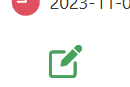
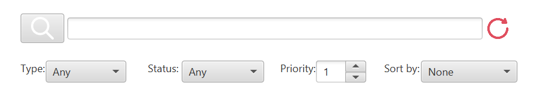

# To-Do List Application


## Overview

This application is designed to help you manage your tasks and to-do lists with ease. The application itself is written in Kotlin and uses JavaFX for the user interface. 

This README will hopefully provide a detailed guide on how to use the application and how to develop it further.

## Table of Contents

1. [Getting Started](#getting-started)
2. [Using the Application](#using-the-application)
3. [Developing the Application](#developing-the-application)
4. [Contributing](#contributing)
5. [License](#license)

## Getting Started

To get started with the To-Do List Application, follow these steps:

1. **Clone the Repository**: Clone the application repository to your local machine using the following command:

   ```bash
   git clone https://github.com/D-Sills/todo-application
   ```

2. **Open the Project**: Open the project in your favoured Kotlin IDE.

3. **Run the Application**: Run the `Main.kt` file, which serves as the entry point to the application. Gradle should take care of downloading the required dependencies and building the application.

## Using the Application

The To-Do List Application allows you to manage your to-do lists and tasks efficiently. Here's how to use the application:

### Adding a New To-Do List


1. Click the "Add New List" button in the application.

2. A new to-do list will be created with the default name "New List." You can click on the list to select it.

#### Editing a To-Do List


1. Click the "Edit List" button to change the name of the list. You can also delete the list using the "Delete List" button.

### Adding a New Task


1. Select a to-do list from the left-hand panel.

2. Click the "Add New Task" button to add a new task to the selected list. If no list is selected, you'll be prompted to choose a list first.

3. Fill in the task details, including title, type, priority, and due date.

4. Click "Save" to add the task to the selected list.

#### Editing a Task



1. Select a task from the list of tasks in the selected to-do list.

2. Click the "Edit Task" button to edit the task details.

3. Click "Save" to save the changes to the task.

### Clearing All Lists


1. Click the "Clear All" button to delete all the to-do lists. You will be asked for confirmation before clearing all lists.

### Filtering and Sorting



1. Use the search bar to filter tasks by title.

2. You can filter tasks by type, priority, and status using the respective dropdowns.

3. Choose a sorting option from the "Sort" dropdown to sort tasks by due date, priority, or status.

4. Click the "Search" button to apply the filters and sorting. This will update the tasks displayed in the selected to-do list, there's also a "Reset" button to reset all filters and sorting options to their default settings.

### Saving and Loading Data

All persistent data is automatically saved to the `todoLists.json` file in the project directory. You could hand modify this file to add or remove tasks and lists, but why would you do that when you have a perfectly good application to do it for you?

## Developing the Application

If you want to further develop the To-Do List Application, here's a brief overview of its structure:

### Controller Classes

The `MainController` is the main class that controls the user interface and handles user interactions. It contains methods for adding lists and tasks, clearing lists, filtering, and sorting tasks. Additionally, there are controller classes for the list and task views, which you can modify to change the behaviour of the views, though you probably won't need to do this?

`AddTaskController` and `EditTaskController` are the controller classes for the add and edit task modals. You can modify these classes to change the behaviour of the add and edit task views. These are quite bare bones at the moment, so you could easily add more functionality to them.

### Model Classes

The application uses two model classes: `TodoListModel` and `TaskModel`. You can extend these classes or create additional ones to capture more details for lists and tasks. 
As they are, the model classes are fairly simple and only contain the basic information required for the application.
For example, you could add a `description` field to the `TaskModel` class to allow users to add a description for each task.

### User Interface

The user interface is defined in FXML files. You can customize the layout and appearance by modifying these FXML files. I used SceneBuilder to create the FXML files, but you can use any tool you like. I got lazy and didn't add any comments to the FXML files, so you'll have to figure out what each element does by looking at the `MainController` class :)

## Contributing

If you want to contribute to the To-Do List Application, please follow these steps:

1. Fork the repository to your GitHub account.

2. Create a new branch for your feature or bug fix.

3. Make your changes and commit them with clear, concise messages.

4. Push your branch to your GitHub repository.

5. Create a pull request to the original repository, explaining your changes and why they are needed.

6. Your pull request will be reviewed, and if accepted, merged into the project.

---

Thank you for using and contributing to the To-Do List Application! Happy task management!

